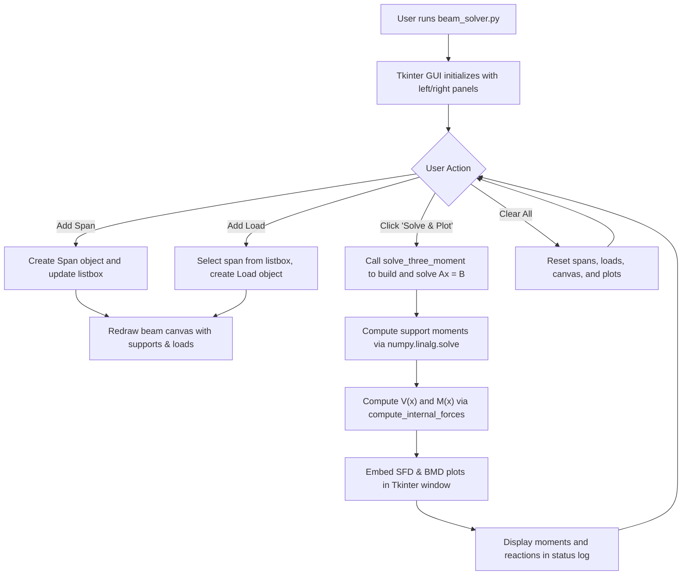

# CE 257 Capstone Project: Technical Implementation Report

## 1. Introduction

This project provides a structural analysis application that computes the internal forces of an arbitrary continuous beam using the **Three-Moment Equation**. The software allows users to define multiple spans, apply point loads and uniformly distributed loads (UDL), and visualize the **Bending Moment Diagram (BMD)** and **Shear Force Diagram (SFD)** — all within a single integrated Graphical User Interface (GUI).

The entire application is contained in a single Python file (`beam_solver.py`) for ease of portability and execution in environments such as Spyder.

## 2. Mathematical Derivation: The Three-Moment Equation

The Three-Moment Equation expresses the relationship between the internal bending moments at three consecutive supports of a continuous beam. It is derived from the principle of consistent deformations, which states that the slope of the deflection curve must be continuous across any intermediate support.

For any two adjacent spans, say $L_i$ (between supports $i-1$ and $i$) and $L_{i+1}$ (between supports $i$ and $i+1$), let $M_{i-1}$, $M_i$, and $M_{i+1}$ be the internal moments at the supports. The slope $\theta$ at support $i$ from the left span must equal the slope from the right span:

$$\theta_{i, \text{left}} = \theta_{i, \text{right}}$$

Using the Moment-Area Theorem, the general form of the Three-Moment Equation is:

$$M_{i-1}L_{i} + 2M_{i}(L_{i} + L_{i+1}) + M_{i+1}L_{i+1} = -6 \left( \frac{A_i \bar{x}_i}{L_i} + \frac{A_{i+1} \bar{x}_{i+1}}{L_{i+1}} \right)$$

Where:
- $M_{i-1}, M_{i}, M_{i+1}$: Bending moments at supports $i-1$, $i$, and $i+1$.
- $L_i, L_{i+1}$: Lengths of spans $i$ and $i+1$.
- $A_i, A_{i+1}$: Area of the simply-supported bending moment diagrams for spans $i$ and $i+1$ due to applied external loads.
- $\bar{x}_i$: Distance from the centroid of $A_i$ to support $i-1$.
- $\bar{x}_{i+1}$: Distance from the centroid of $A_{i+1}$ to support $i+2$.

### Right-Hand Side Expressions for Common Loads

- **Uniform Load ($w$)**: The RHS term for a single span evaluates to $\frac{w L^3}{4}$.
- **Point Load ($P$)**: At a distance $a$ from the left support (and $b = L - a$ from the right support), the RHS term for the span to the left of the centre support is $\frac{P a}{L}(L^2 - a^2)$, and for the span to the right, it is $\frac{P b}{L}(L^2 - b^2)$.

## 3. Software Architecture and Logic

The entire application is organised in a single file, `beam_solver.py`, structured into four logical sections:

### 3.1 Data Classes

| Class | Purpose |
|-------|---------|
| `Load` | Stores load type (uniform/point), magnitude, and distance. Provides methods `rhs_left()` and `rhs_right()` that return the Three-Moment Equation right-hand-side contribution when the load's span is to the left or right of a support, respectively. |
| `Span` | Stores span length and a list of `Load` objects. Provides methods `total_rhs_left()` and `total_rhs_right()` to aggregate contributions from all loads on the span. |

### 3.2 Solver Functions

| Function | Purpose |
|----------|---------|
| `solve_three_moment(spans)` | Constructs the coefficient matrix $A$ and the RHS vector $B$ from the Three-Moment Equation for each internal support. Solves the system $Ax = B$ using `numpy.linalg.solve` and returns the moment at every support (with $M_0 = M_n = 0$ for simply-supported end conditions). |
| `compute_internal_forces(spans, moments)` | Iterates over each span, superimposes load effects and end-moment corrections, and returns arrays of position $x$, shear force $V(x)$, bending moment $M(x)$, and support reactions. |

### 3.3 GUI Application (`BeamApp` class)

The `BeamApp` class builds a single Tkinter window with two panels:

- **Left Panel (Controls):**
  - *Beam Geometry* section — enter span lengths and click "Add Span". Defined spans appear in a **listbox**.
  - *Applied Loading* section — select a span from the listbox, choose load type (uniform or point), enter magnitude and distance, then click "Add Load to Selected Span". The distance field is automatically shown/hidden based on load type.
  - *Action Buttons* — "Clear All" resets the beam; "Solve & Plot BMD/SFD" triggers the analysis.
  - *Status Log* — a text area that displays messages about added spans, loads, solved moments, reactions, and errors.

- **Right Panel (Visualization):**
  - *Beam Visualization* canvas — draws the beam, triangular supports, span lengths, and load arrows in real-time as the user adds geometry and loads.
  - *Analysis Results* area — after solving, the SFD and BMD are rendered using `matplotlib` and **embedded directly inside the Tkinter window** via `FigureCanvasTkAgg`, eliminating the need for a separate pop-up.

### 3.4 Entry Point

The file ends with the standard Tkinter main loop:

```python
root = tk.Tk()
app = BeamApp(root)
root.mainloop()
```

This allows the application to be run directly in Spyder or from the command line.

### Flowchart of Software Logic



## 4. Key Design Decisions

1. **Single-File Architecture** — All classes, solver functions, and GUI code reside in `beam_solver.py`. This simplifies distribution and is compatible with running directly in Spyder.

2. **Span Selection via Listbox** — Instead of requiring the user to type a numeric span index, the application uses a Tkinter `Listbox` widget. Users simply click on the span they wish to load. This reduces input errors and improves usability.

3. **Embedded Matplotlib Plots** — The SFD and BMD are rendered inside the main application window using `FigureCanvasTkAgg`, providing a unified experience without separate pop-up windows.

4. **Dynamic UI Elements** — The "Distance 'a'" input field is automatically hidden when the load type is set to "uniform" and shown when set to "point", reducing visual clutter.

## 5. Dependencies

| Package | Version | Purpose |
|---------|---------|---------|
| `numpy` | ≥1.20 | Matrix construction and linear algebra solver |
| `matplotlib` | ≥3.4 | Plotting SFD and BMD, embedded via `FigureCanvasTkAgg` |
| `tkinter` | (stdlib) | GUI framework (bundled with Python) |

## 6. Conclusion

The implementation successfully bridges the theoretical concepts of structural analysis and programming. The Three-Moment Equation serves as a robust solver for statically indeterminate continuous beams, and the matrix manipulation handled by `numpy` provides near-instantaneous computation times. By consolidating all code into a single file and embedding visualizations within the main window, the application is both portable and user-friendly.
